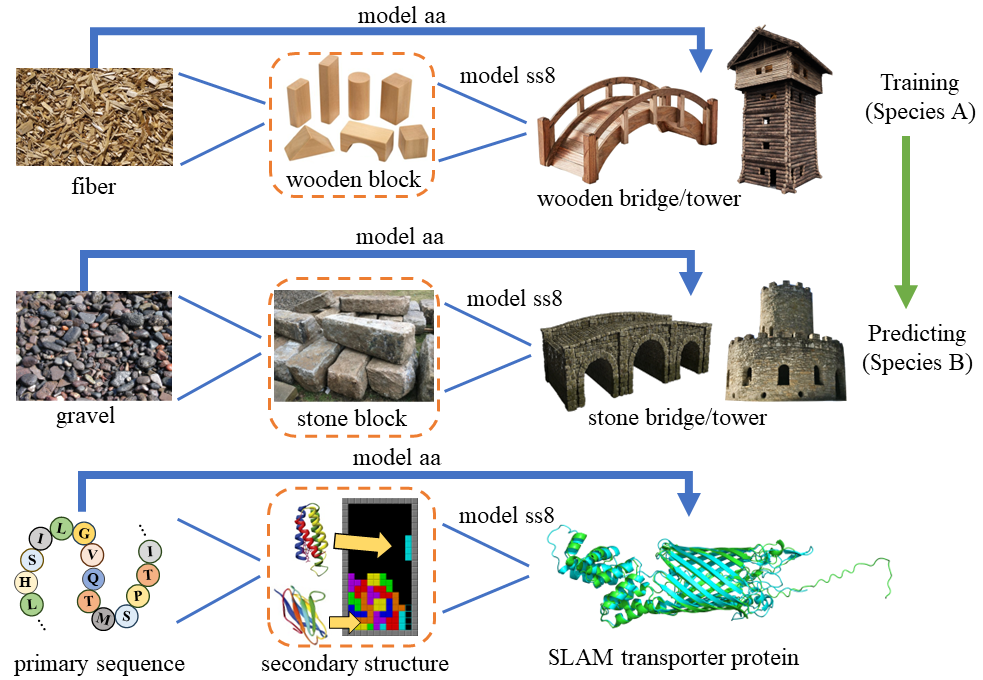

# DeepSS2GO


## Introduction

DeepSS2GO is a deep learning predictor th incorporates secondary structure features along with primary sequence and homology information. The algorithm expertly harnesses the speed of sequence-based analysis and the accuracy of structure-based analysis, streamlining primary sequences and elegantly sidestepping the time-consuming challenges of tertiary structure analysis. The results show that the prediction performance surpasses state-of-the-art algorithms. It has the ability to predict key functions by effectively utilizing secondary structure information, rather than broadly predicting general Gene Ontology terms. Additionally, DeepSS2GO predicts five times faster than advanced algorithms, making it highly applicable to massive sequencing data.




## Dependency

DeepSS2GO is developed under Linux environment with:

```
# Name                    Version                  
blast                     2.5.0                        
click                     8.1.3          
diamond                   2.1.7          
fair-esm                  2.0.0          
matplotlib                3.7.1        
numpy                     1.24.3       
pandas                    1.3.5        
pip                       23.1.2       
python                    3.8.16         
scikit-learn              1.2.2        
scipy                     1.10.1       
seaborn                   0.12.2       
torch                     1.8.0+cu111  
torchaudio                0.8.0        
torchsummary              1.5.1        
torchvision               0.9.0+cu111  
tqdm                      4.65.0       
transformers              4.29.2              
```

<!-- Conda environment can be found here:
```
huggingface-
``` -->


## Usage


### Step 1. Download and setup pre-trained models

Download and setup the following pre-trained models:

> For aa to ss8 (step 2):
- ESM1b_t33_650M_UR50S 
- Prot_T5_XL_UniRef50 
- SPOT1DLM_checkpoints

> Simply run, predict BPO/CCO/MFO in a batch [step 3.1](#3.1.-Simply-run,-predict-BPO/CCO/MFO-in-a-batch:):
- s3_AlphaBeta_bpccmf

> For higher precision purpose, predict BPO/CCO/MFO separately [step 3.2](#3.2.-For-higher-precision-purpose,-predict-BPO/CCO/MFO,-separately:):
- s3_AlphaBeta_TrainALL00_TestALL00_bp_aaK16F32768_ss8K32F32768
- s3_AlphaBeta_TrainALL00_TestALL00_cc_aaK16F32768_ss8K48F16384
- s3_AlphaBeta_TrainALL00_TestALL00_mf_aaK16F32768_ss8K32F32768 


Download links:
```bash
# ESM-1b 
# Save to: /home/USERNAME/.cache/torch/hub/checkpoints/esm1b_t33_650M_UR50S-contact-regression.pt & esm1b_t33_650M_UR50S.pt
https://dl.fbaipublicfiles.com/fair-esm/models/esm1b_t33_650M_UR50S.pt

# ProtTrans
# Save to: /home/USERNAME/.../Prot_T5_XL_UniRef50/
https://huggingface.co/Rostlab/prot_t5_xl_uniref50/tree/main
# Modify path_Prot_T5_XL_UniRef50 in step0_DataPreprocessingSetting.py according to previous path
path_Prot_T5_XL_UniRef50 = /home/USERNAME/.../Prot_T5_XL_UniRef50/

# SPOT1DLM_checkpoints.xz
# Unpack and save to: /home/fsong/work/py_proj/prot_algo/DeepSS2GO_v1/pub_data/SPOT1DLM_checkpoints
wget https://huggingface.co/orca233/DeepSS2GO/resolve/main/SPOT-LM-checkpoints.xz

# s3_AlphaBeta_bpccmf/
# s3_AlphaBeta_TrainALL00_TestALL00_bp_aaK16F32768_ss8K32F32768/
# s3_AlphaBeta_TrainALL00_TestALL00_cc_aaK16F32768_ss8K48F16384/
# s3_AlphaBeta_TrainALL00_TestALL00_mf_aaK16F32768_ss8K32F32768/ 
# Unpack and save to: ..../DeepSS2GO/PredictNew/s3_PredictNew_AlphaBeta/
wget https://huggingface.co/orca233/DeepSS2GO/resolve/main/s3_AlphaBeta_bpccmf.tar.gz?download=true
wget https://huggingface.co/orca233/DeepSS2GO/resolve/main/s3_AlphaBeta_TrainALL00_TestALL00_bp_aaK16F32768_ss8K32F32768.tar.gz?download=true
wget https://huggingface.co/orca233/DeepSS2GO/resolve/main/s3_AlphaBeta_TrainALL00_TestALL00_cc_aaK16F32768_ss8K48F16384.tar.gz?download=true
wget https://huggingface.co/orca233/DeepSS2GO/resolve/main/s3_AlphaBeta_TrainALL00_TestALL00_mf_aaK16F32768_ss8K32F32768.tar.gz?download=true

```


### Step 2.  Data Preprocessing

In this section, primary amino sequence (aa) will be converted to secondary structure (ss8) by modified SPOT-1D-LM algorithm [Ref](https://zenodo.org/record/4644188).

#### 2.1. Save the awating test fasta file to: `/pub_data/data_new/new_aa.fa`

Input fasta file format should be like: 

```
>slam1
MVIFYFCGKTFMPARNRWMLLLPLLASAAYAEETPREPDLRSRPEFRLHEAEVKPIDREKVPGQVREKGKVLQIDGETLLKNPELLSRAMYSAVVSNNIAGIRVILPIYLQQAQQDKMLALYAQGILAQADGRVKEAISHYRELIAAQPDAPAVRMRLAAALFENRQNEAAADQFDRLKAENLPPQLMEQVELYRKALRERDAWKVNGGFSVTREHNINQAPKRQQYGKWTFPKQVDGTAVNYRLGAEKKWSLKNGWYTTAGGDVSGRVYPGNKKFNDMTAGVSGGIGFADRRKDAGLAVFHERRTYGNDAYSYTNGARLYFNRWQTPKWQTLSSAEWGRLKNTRRARSDNTHLQISNSLVFYRNARQYWMGGLDFYRERNPADRGDNFNRYGLRFAWGQEWGGSGLSSLLRLGAAKRHYEKPGFFSGFKGERRRDKELNTSLSLWHRALHFKGITPRLTLSHRETRSNDVFNEYEKNRAFVEFNKTF
>slam2
MLYFRYGFLVVWCAAGVSAAYGADAPAILDDKALLQVQRSVSDKWAESDWKVENDAPRVVDGDFLLAHPKMLEHSLRDALNGNQADLIASLADLYAKLPDYDAVLYGRARALLAKLAGRPAEAVARYRELHGENAADERILLDLAAAEFDDFRLKSAERHFAEAAKLDLPAPVLENVGRFRKKTEGLTGWRFSGGISPAVNRNANNAAPQYCRQNGGRQICSVSRAERAAGLNYEIEAEKLTPLADNHYLLFRSNIGGTSYYFSKKSAYDDGFGRAYLGWQYKNARQTAGILPFYQVQLSGSDGFDAKTKRVNNRRLPPYMLAHGVGVQLSHTYRPNPGWQFSVALEHYRQRYREQDRAEYNNGRQDGFYVSSAKRLGESATVFGGWQFVRFVPKRETVGGAVNNAAYRRNGVYAGWAQEWRQLGGLNSRVSASYARRNYKGIAAFSTEAQRNREWNVSLALSHDKLSYKGIVPALNYRFGRTESNVPYAKRRNSEVFVSADWRF
```
> In case your protein name contains dot '.', or sequence in multi-line, please run `utils_modified_input_fasta.py` to uniform input `new_aa.fa` as following format.


#### 2.2. Convert primary sequence to secondary structure

Navigate to the directory: 
`..../DeepSS2GO/PredictNew/s1_DataPreprocessing_PredictNew/`

Execute steps 1-8 in `s1_DataPreprocessing_New/`. The following final files will be generated in `/pub_data/data_new/`:
- new_clean_aa.pkl 
- new_clean_aa.fa
- new_clean_ss8.pkl 
- new_clean_ss8.fa


### Step 3. Prediction

> If you require general predictions, run only step 3.1. For higher precision, proceed with step 3.2 instead.

#### 3.1. Simply run, predict BPO/CCO/MFO in a batch:


<!-- Download and unpack `s3_AlphaBeta_bpccmf` -->

Navigate to the directory and run: 
`..../DeepSS2GO/PredictNew/s3_PredictNew_AlphaBeta/s3_AlphaBeta_bpccmf/`

```bash
# Modify (step6_cpData_Diamond4New.sh) with your own path
path_base="/home/USERNAME/work/py_proj/prot_algo/DeepSS2GO/"

bash step6_cpData_Diamond4New.sh  # Copy these four *pkl/fa files to the corresponding directories and run diamond
bash step7_PredictAlphaBeta_New.sh  # Set the threshold accordingly 
```

Find Results in directory: `/data/` as:
- results_bp.csv 
- results_cc.csv
- results_mf.csv


#### 3.2. For higher precision purpose, predict BPO/CCO/MFO, separately:


Take BPO as example:
Navigate to the directory and perform the same steps as step 3.1: 
`..../DeepSS2GO/PredictNew/s3_PredictNew_AlphaBeta/s3_AlphaBeta_TrainALL00_TestALL00_bp_aaK16F32768_ss8K32F32768/`

Same for CCO and MFO.
- s3_AlphaBeta_TrainALL00_TestALL00_bp_aaK16F32768_ss8K32F32768/
- s3_AlphaBeta_TrainALL00_TestALL00_cc_aaK16F32768_ss8K48F16384/
- s3_AlphaBeta_TrainALL00_TestALL00_mf_aaK16F32768_ss8K32F32768/


