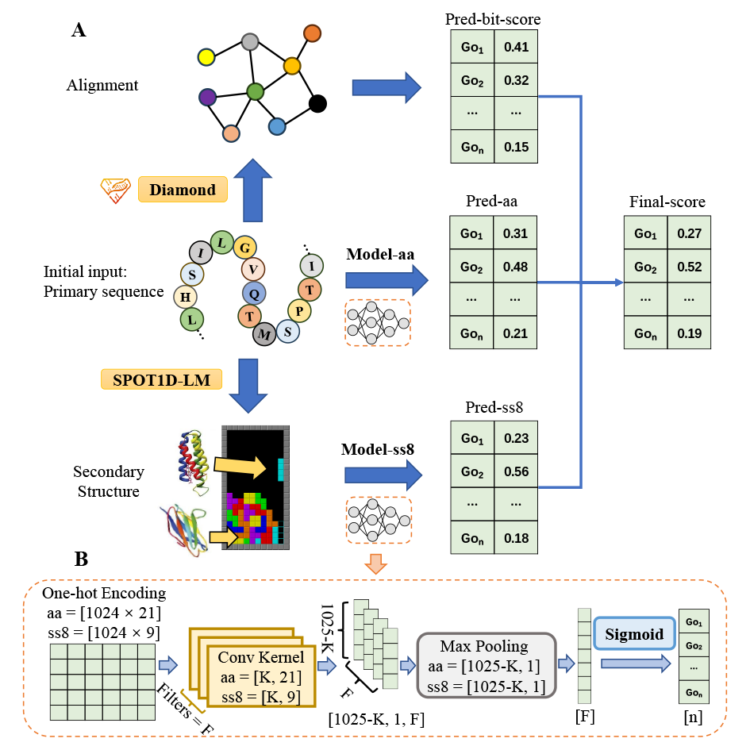

# DeepSS2GO


## Introduction

DeepSS2GO is a deep learning predictor th incorporates secondary structure features along with primary sequence and homology information. Experimental results show that the predictor performs well, with an overall accuracy surpassing state-ofthe-art algorithms. It accurately predicts key functions by effectively utilizing secondary structure information, rather than broadly predicting general Gene Ontology terms. Additionally, DeepSS2GO predicts five times faster than advanced algorithms, making it highly applicable to massive sequencing data.





## Dependency

DeepSS2GO is developed under Linux environment with:

```
# Name                    Version                  
blast                     2.5.0                        
click                     8.1.3          
diamond                   2.1.7          
fair-esm                  2.0.0          
matplotlib                3.7.1        
numpy                     1.24.3       
pandas                    1.3.5        
pip                       23.1.2       
python                    3.8.16         
scikit-learn              1.2.2        
scipy                     1.10.1       
seaborn                   0.12.2       
torch                     1.8.0+cu111  
torchaudio                0.8.0        
torchsummary              1.5.1        
torchvision               0.9.0+cu111  
tqdm                      4.65.0       
transformers              4.29.2              
```


<!-- ## Content 
- PredictNew/: Scrpit for predicting new protein function from sequence.
- pub_data/: Unknown protein fasta files -->


## Usage


### Part 1. Set up

Download and setup for pre-trained models

- esm1b_t33_650M_UR50S 
- Prot_T5_XL_UniRef50
- SPOT1DLM_checkpoints
- model_checkpoint_aa.pth
- model_checkpoint_ss8.pth

Download links:
```bash
# ESM-1b 
# Save to: /home/USERNAME/.cache/torch/hub/checkpoints/esm1b_t33_650M_UR50S-contact-regression.pt & esm1b_t33_650M_UR50S.pt
https://dl.fbaipublicfiles.com/fair-esm/models/esm1b_t33_650M_UR50S.pt

# ProtTrans
# Save to: /home/USERNAME/.../Prot_T5_XL_UniRef50/
https://huggingface.co/Rostlab/prot_t5_xl_uniref50/tree/main
# Modify path_Prot_T5_XL_UniRef50 in step0_DataPreprocessingSetting.py according to previous path
path_Prot_T5_XL_UniRef50 = /home/USERNAME/.../Prot_T5_XL_UniRef50/

# SPOT1DLM_checkpoints.xz
# Unpack and save to: /home/fsong/work/py_proj/prot_algo/DeepSS2GO_v1/pub_data/SPOT1DLM_checkpoints
https://huggingface.co/orca233/DeepSS2GO/resolve/main/SPOT-LM-checkpoints.xz

# model_checkpoint_aa.pth
# Save to: ..../DeepSS2GO/PredictNew/s3_PredictNew_AlphaBeta/s3_AlphaBeta_bpccmf/data
https://huggingface.co/orca233/DeepSS2GO/resolve/main/model_checkpoint_aa.pth

# model_checkpoint_ss8.pth
# Save to: ..../DeepSS2GO/PredictNew/s3_PredictNew_AlphaBeta/s3_AlphaBeta_bpccmf/data
https://huggingface.co/orca233/DeepSS2GO/resolve/main/model_checkpoint_ss8.pth
```


### Part 2.  Data Preprocessing

In this section, primary amino sequence (aa.fa) will be converted to secondary structure (ss8.fa) by modified SPOT-1D-LM algorithm.

2.1. Save testing fasta file to: `/pub_data/data_new/new_aa.fa`

e.g.
```plaintext
>slam1
MVIFYFCGKTFMPARNRWMLLLPLLASAAYAEETPREPDLRSRPEFRLHEAEVKPIDREKVPGQVREKGKVLQIDGETLLKNPELLSRAMYSAVVSNNIAGIRVILPIYLQQAQQDKMLALYAQGILAQADGRVKEAISHYRELIAAQPDAPAVRMRLAAALFENRQNEAAADQFDRLKAENLPPQLMEQVELYRKALRERDAWKVNGGFSVTREHNINQAPKRQQYGKWTFPKQVDGTAVNYRLGAEKKWSLKNGWYTTAGGDVSGRVYPGNKKFNDMTAGVSGGIGFADRRKDAGLAVFHERRTYGNDAYSYTNGARLYFNRWQTPKWQTLSSAEWGRLKNTRRARSDNTHLQISNSLVFYRNARQYWMGGLDFYRERNPADRGDNFNRYGLRFAWGQEWGGSGLSSLLRLGAAKRHYEKPGFFSGFKGERRRDKELNTSLSLWHRALHFKGITPRLTLSHRETRSNDVFNEYEKNRAFVEFNKTF
>slam2
MLYFRYGFLVVWCAAGVSAAYGADAPAILDDKALLQVQRSVSDKWAESDWKVENDAPRVVDGDFLLAHPKMLEHSLRDALNGNQADLIASLADLYAKLPDYDAVLYGRARALLAKLAGRPAEAVARYRELHGENAADERILLDLAAAEFDDFRLKSAERHFAEAAKLDLPAPVLENVGRFRKKTEGLTGWRFSGGISPAVNRNANNAAPQYCRQNGGRQICSVSRAERAAGLNYEIEAEKLTPLADNHYLLFRSNIGGTSYYFSKKSAYDDGFGRAYLGWQYKNARQTAGILPFYQVQLSGSDGFDAKTKRVNNRRLPPYMLAHGVGVQLSHTYRPNPGWQFSVALEHYRQRYREQDRAEYNNGRQDGFYVSSAKRLGESATVFGGWQFVRFVPKRETVGGAVNNAAYRRNGVYAGWAQEWRQLGGLNSRVSASYARRNYKGIAAFSTEAQRNREWNVSLALSHDKLSYKGIVPALNYRFGRTESNVPYAKRRNSEVFVSADWRF
```


2.2. Navigate to the directory: 
`..../DeepSS2GO/PredictNew/s1_DataPreprocessing_PredictNew/`


2.3. Convert primary sequence to secondary structure

Execute steps 1-8 in `s1_DataPreprocessing_New/`. The following final files will be generated in `/pub_data/data_new/`:
- new_clean_aa.pkl 
- new_clean_aa.fa
- new_clean_ss8.pkl 
- new_clean_ss8.fa


### Part 3. Prediction

3.1. Navigate to the directory: 
`..../DeepSS2GO/PredictNew/s3_PredictNew_AlphaBeta/s3_AlphaBeta_bpccmf/`


3.2. Predict BPO/CCO/MFO with the following directories:

```bash
# Modify (step6_cpData_Diamond4New.sh) with your own path
path_base="/home/USERNAME/work/py_proj/prot_algo/DeepSS2GO/"

bash step6_cpData_Diamond4New.sh  # Copy these four *pkl/fa files to the corresponding directories and run diamond

bash step7_PredictAlphaBeta_New.sh  # Set the threshold accordingly 
```


3.3. Find Results in directory: `/data/` as:
- results_bp.csv 
- results_cc.csv
- results_mf.csv


[comment]: <> (- s3_AlphaBeta_TrainALL00_TestALL00_bp_aaK16F32768_ss8K32F32768/)
[comment]: <> (- s3_AlphaBeta_TrainALL00_TestALL00_cc_aaK16F32768_ss8K48F16384/)
[comment]: <> (- s3_AlphaBeta_TrainALL00_TestALL00_mf_aaK16F32768_ss8K32F32768/)

[comment]: <> (Take BPO as an example, navigate to the directory:)
[comment]: <> (`s3_AlphaBeta_TrainALL00_TestALL00_bp_aaK16F32768_ss8K32F32768/` )

[comment]: <> (Perform the same steps for CCO nd MFO in the following directories:)
[comment]: <> (- `s3_AlphaBeta_TrainALL00_TestALL00_cc_aaK16F32768_ss8K48F16384/`)
[comment]: <> (- `s3_AlphaBeta_TrainALL00_TestALL00_mf_aaK16F32768_ss8K32F32768/`)


