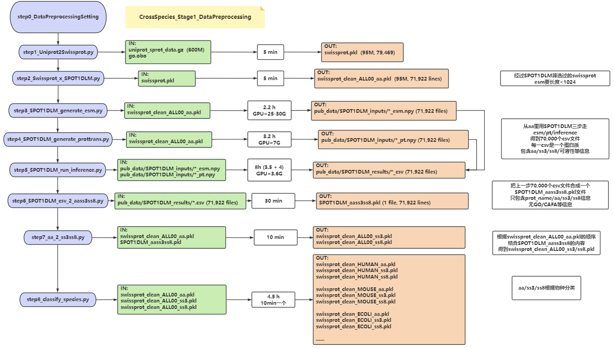
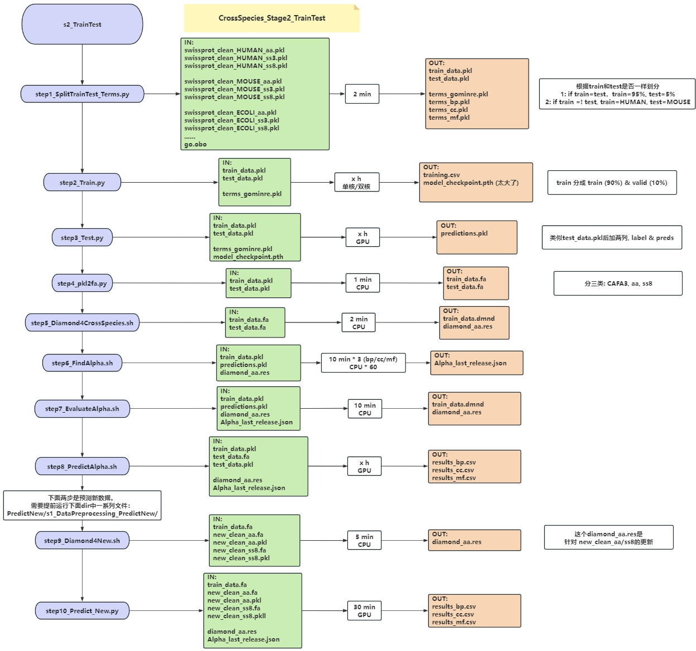
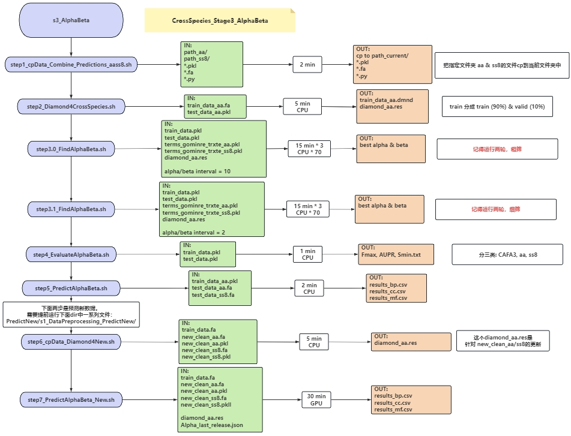
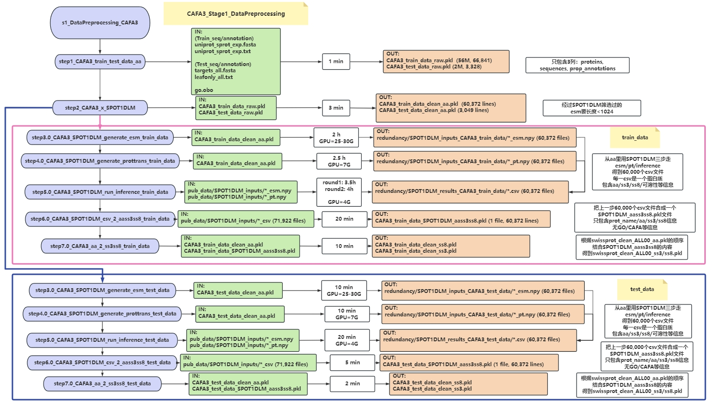
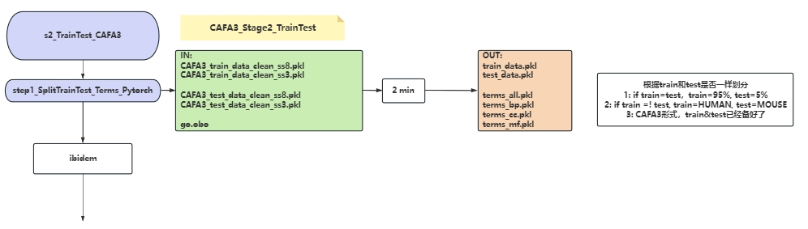
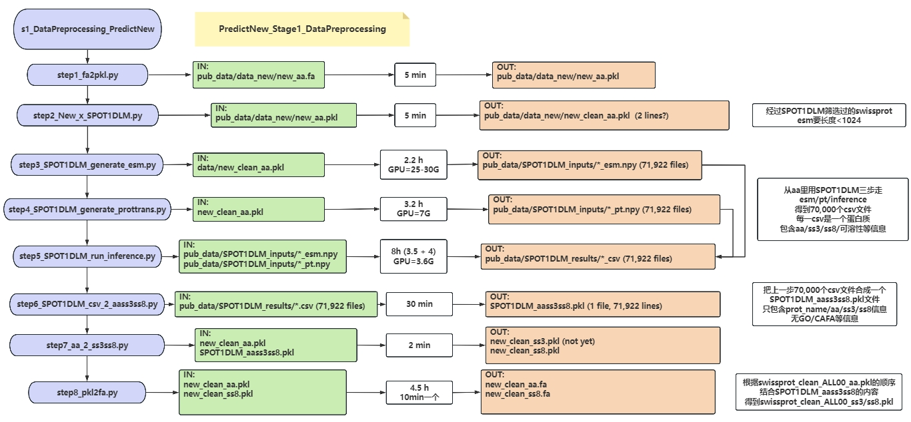

# DeepSS2GO
3个板块：     
CrossSpecies/ 不同物种之间的交叉训练验证     
CAFA3/ 横向对比三大指标结果  
PredictNew/ 给出新的未知的fasta，GO预测

其他文件夹：  
output/ 存放CS中大量的输出文件  
pub_data/ 存放三大类的公共数据  
redundancy/ 存放 data preprocessing中生成的大量 *.npt & *.csv 文件  


## 板块一：Cross species
跨物种训练6类：ARATH, ECOLI, HUMAN, MOUSE, MYCTU, YEAST, & ALL00  


### s1_DataPreprocessing_CrossSpecies/: 预处理数据  


- step1_Uniprot2Swissprot.py: 挑出手工注释蛋白质
- step2_Swissprot_x_SPOT1DLM.py: 删除长度超过1024的蛋白质，和非标准氨基酸
- step3_SPOT1DLM_generage_esm.py: 生成 *esm.npy
- step4_SPOT1DLM_generate_prottrans.py: 生成 *pt.npy
- step5_SPOT1DLM_run_inference.py： 生成 *.csv
- step6_SPOT1DLM_csv_2_aass3ss8.py: 生成 SPOT1DLM_aass3ss8.pkl 
- step7_aa_2_ss3ss8.py: 生成 swissprot_clean_ALL00_ss3.pkl & swissprot_clean_ALL00_ss8.pkl
- step8_ClassifySpecies.py: 生成不同物种的 ss3/ss8.pkl


### s2_TrainTest/: 训练，测试，评估   


> 评估&预测CrossSpecies数据
- step1_SplitTrainTest_Terms: 拆分原始数据为train & test，找到对应terms 
- step2_Train: 训练，得到model + training.csv  
- step3_Test: 测试，得到predictions.pkl  
- step4_pkl2fa: 转格式
- step5_Diamond4CrossSpecies: 得到diamond_aa.res
- step6_FindAlpha: 找到最佳Alpha
- step7_EvaluateAlpha: 根据上面得到的Alpha，评估三大指标，Fmax, AUPR, Smin
- step8_PredictAlpha: 预测 test_data.pkl的结果，得到 results_bp/cc/mf.csv

> 评估&预测新的未知的数据有两种情况，
- step9_cpData_Diamond4New: 为全新的，未知的数据 更新Diamond  
- step10_Predict_New: 根据aa/ss8 对未知数据进行预测  

> s2_TrainTest 使用方法： 

CrossSpecies/s2_TrainTest/ 为global文件夹，  

在构建好pub_data后，比如需要 TrainECOLI_TestYEAST_aa，则
1. 在 CrossSpecies/下将整个 s2_TrainTest/ 复制为：
   s2_TrainTest_TrainECOLI_TestYEAST_aa/ (此为global文件夹)
   
2. 修改新文件夹中的 step0_TrainTestSetting_global.py 参数。  
   特别注意： 
   - 'device_ids': [0, 1]
   - 'dir0': 'test_TrainHUMAN_TestHUMAN_aa_test/'
   - 'aa_ss': 'aa'
   - 'train_data': 'HUMAN'
   - 'test_data': 'HUMAN'
   - 'kernels': [8, 16, 24, ...]
   - 'filters': [16, 32, 64, ...]   
   
3. 执行 run_KernelX_FilterY.py，会在 output/中新建文件夹：  
   test_TrainECOLI_TestYEAST_aa/ (此为local文件夹的母文件夹 = dir0)  
   并结合不同的kernel&filter生成一系列的local子文件夹：  
   e.g. DeepSS2GO_Kernel104_Filter8192_Ontsall/ (此为local文件夹的子文件夹 = dir1)  
   并将global文件夹中的文件cp到local子文件夹中，生成新的step0_TrainTestSetting_local.py  
   i.e.  
   cp -rf CrossSpecies/s2_TrainTest_TrainX_TestY_aa/ output/dir0/dir1/  
   e.g.  
   cp -rf CrossSpecies/s2_TrainTest_TrainECOLI_TestYEAST_aa/ output/test_TrainECOLI_TestYEAST_aa/DeepSS2GO_Kernel104_Filter8192_Ontsall/
   
4. 在每一个local子文件夹中，根据step0_TrainTestSetting_local.py的具体参数，执行: step1-8。
   一般可能只运行 step1-3，后面选择合适的单独运行 step4-8用来 find_alpha。


### s3_AlphaBeta/ 结合 alpha + beta + Diamond 计算 (和s2逻辑有点像)


> 评估&预测CrossSpecies数据
- step1_cpData_Combine_Predictions_aass8.sh: 
  把aa&ss8 中的各种 pkl/fa cp到当前文件夹，将predictions_aa.pkl & predictions_ss8.pkl结合
- step2_Diamond4CrossSpecies.sh: 不解释了
- step3.0_FindAlphaBeta_CoarseScreening.sh：粗筛，间隔10 
- step3.1_FindAlphaBeta_FineScreening.sh：细筛，间隔2
- step4_EvaluateAlphaBeta.sh: 三大指标
- step5_PredictAlphaBeta.sh： 预测结果，得到results_bp/cc/mf.csv
  
> 评估&预测新的未知数据
- step6_cpData_Diamond4New.sh
- step7_PredictAlphaBeta_New.sh

> s3_AlphaBeta 使用方法:

1. 在s2_TrainTest_TrainALL00_TestALL00_aa/ss8结束，找到各自的 bp/cc/mf最值。
   
2. 相互组合，比如对于bp，aa在K16F65536最大，ss8在K48F8192最大，则将s3_AlphaBeta/ 完整 复制拷贝到：    
   output/AlphaBeta/s3_AlphaBeta_TrainALL00_TestALL00_bp_aaK16F65536_ss8K48F8192/
   
3. 执行 step1-5  
   <font color=red size="6">**特别注意 3点：**</font>  
   每个新文件夹要修改两点：  
   1. 前期设定：修改step1_cp_data.sh中的参数    
      ```
      path_aa="${path_base}output/Best4PredictAlphaBeta/test_TrainALL00_TestALL00_aa_DeepSS2GO_Kernel16_Filter65536_Ontsall/"
      path_ss8="${path_base}output/Best4PredictAlphaBeta/test_TrainALL00_TestALL00_ss8_DeepSS2GO_Kernel48_Filter8192_Ontsall/"
      ```
   2. 前期设定：step3.0-3.1-4-5中的ont只选一个即可, bp/cc/mf。其他的注释掉。    

   <br>
   
   3. 后期执行： step3 Find Alpha Beta 筛选要进行两轮 (step3.0 & step 3.1)，要人工不能自动  
   - 第一轮，粗筛，step3.0_FindAlphaBeta_CoarseScreening：
     对指定的某一个ont(bp/cc/mf)进行    
     ```bash
      -o bp --alpha-range '0, 101, 10' --beta-range '0, 101, 10'   
      # 粗筛结果：  
      # bp 在a=0.2, b=0.3取最大  (0.2, 0.3, -0.5345571091830763)  
      # {'alphas': {'bp': 0.2, 'cc': 0.5, 'mf': 0.0}, 'betas': {'bp': 0.3, 'cc': 0.3, 'mf': 0.8}}

      ```
     
   - 第二轮，细筛，step3.1_FindAlphaBeta_FineScreening：  
     根据粗筛结果，新的range 去 0.1-0.3, 0.2-0.4，间隔均为2：  
      ```bash
      -o bp --alpha-range '10, 31, 2' --beta-range '20, 41, 2'  
      # 细筛结果：  
      # (0.16, 0.28, -0.535361639858736)  
      # {'alphas': {'bp': 0.16, 'cc': 0.5, 'mf': 0.0}, 'betas': {'bp': 0.28, 'cc': 0.3, 'mf': 0.8}}
      ```
    

   

## 板块二：CAFA3
The Critical Assessment of protein Function Annotation algorithms (CAFA3)
可标准以横向和其他文章做对比。


### s1_DataPreprocessing_CAFA3/: 预处理数据


同 s1_DataPreprocessing_CrossSpecies/步骤，
在step0_global/local.py中修改 train_data = test_data = 'CAFA3' 即可。


### s2_TrainTest_CAFA3/: 训练，测试，评估


同 CrossSpecies 的 s2 类似


[comment]: <> (。。。 未完，本章节继续加载中 。。。)


## 板块三：TrainALL & Predict New
> case 0 & case 1 前两步的数据预处理 **"相同"**  

### case 0: 只用 aa/ss8_model + Diamond 预测
#### PredictNew/s1_DataPreprocessing_PredictNew/ 预处理数据



1. 准备初始fasta文件，aa格式，存放在：pub_data/data_new/new_aa.fa  
2. 执行 s1_DataPreprocessing_New中的step1-8:
- step1_fa2pkl.py: new_aa.fa 转成 pkl
- step2_New_x_SPOT1DLM.py:  去掉aa长度>1024的
- step3_SPOT1DLM_generate_esm.py: 
- step4_SPOT1DLM_generate_prottrans.py: 
- step5_SPOT1DLM_run_inference.py: 
- step6_SPOT1DLM_csv_2_aass3ss8.py: 生成 new_SPOT1DLM_aass3ss8.pkl 
- step7_aa_2_ss3ss8.py: 生成 new_clean_aa.pkl & new_clean_ss8.pkl
- step8_pkl2fa.py: 上面两个转成 fa

最终在pub_data/data_new/生成：  
new_clean_aa.pkl
new_clean_aa.fa  
new_clean_ss8.pkl
new_clean_ss8.fa  


#### CrossSpecies/s2_TrainTest/step9-10
3. 执行 CrossSpecies/s2_TrainTest/step9_cpData_Diamond4New.sh：把这4个pkl/fa文件cp到对应文件夹中，并diamond。      
   e.g. output/test_TrainALL00_TestALL00_aa_DeepSS2GO_Kernel8_Filter65536_Ontsall/data/
   
4. 执行 CrossSpecies/s2_TrainTest/step10_Predict_New: 根据aa/ss8 对未知数据进行预测


### case 1: 用 aa_model + ss8_model + Diamond 预测
#### PredictNew/s1_DataPreprocessing_PredictNew/ 预处理数据
同 case0 数据预处理 (PredictNew/s1_DataPreprocessing_PredictNew/)


#### CrossSpecies/s3_AlphaBeta/step6-7

3. 执行 CrossSpecies/s3_AlphaBeta/step6_cpData_Diamond4New.sh

4. 执行 CrossSpecies/s3_AlphaBeta/step7_PredictAlphaBeta_new.sh


<font face="STCAIYUN">******** And they all lived happily ever after! ********</font>


