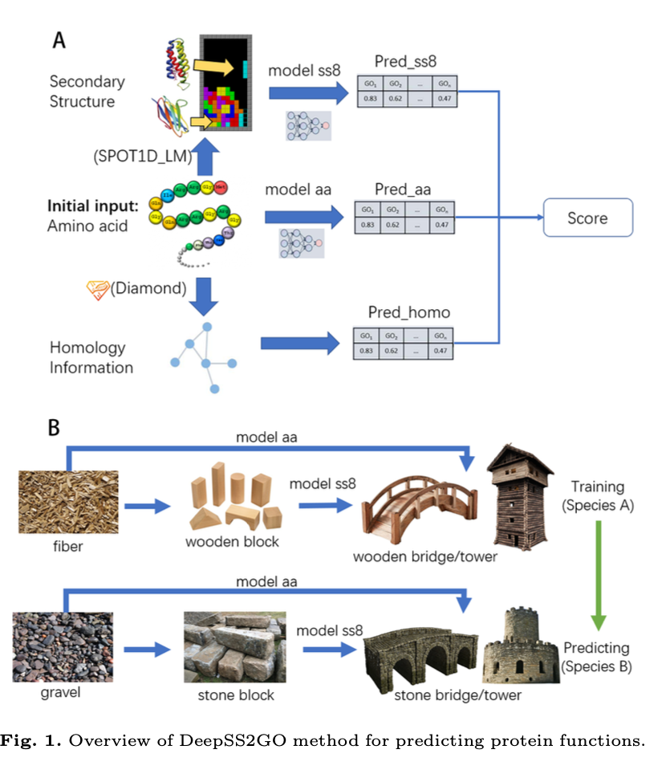

# PredictNew

[TOC]

## Introduction

DeepSS2GO is a novel approach in protein function prediction that integrates primary sequence and secondary structure using a traditional deep convolutional neural network.

**Significance:**This innovative method showcases the substantial benefits of incorporating secondary structure information. 



## Environment:

Test On :

**Hardware:** GPU,  CPU,Memory

**Software: **reconmmendly create by conda,  and you can directly with the command `conda pack ?`

## Uuage

### Part 1.  Data Preprocessing

**Convert aa.fa to ss8.fa and generate pkl file**

Navigate to the main directory: `/PredictNew/s1_DataPreprocessing_PredictNew/`

#### 1. Download pre-trained models (used in step 3 and step 4):

- esm1b_t33_650M_UR50S  #  download automatically is slow
- Prot_T5_XL_UniRef50

Download links:
```bash
https://dl.fbaipublicfiles.com/fair-esm/models/esm1b_t33_650M_UR50S.pt
# Save to: /home/USERNAME/.cache/torch/hub/checkpoints/esm1b_t33_650M_UR50S-contact-regression.pt & esm1b_t33_650M_UR50S.pt

https://huggingface.co/Rostlab/prot_t5_xl_uniref50/tree/main
# Save to the specified directory: /home/USERNAME/.../Prot_T5_XL_UniRef50/

# Modify path_Prot_T5_XL_UniRef50 in step0_DataPreprocessingSetting.py
path_Prot_T5_XL_UniRef50 = /home/USERNAME/.../Prot_T5_XL_UniRef50/
```

#### 2. Prepare the initial fasta file,

 The files is in: `/pub_data/data_new/new_aa.fa`

Eg:
```plaintext
>slam1
MVIFYFCGKTFMPARNRWMLLLPLLASAAYAEETPREPDLRSRPEFRLHEAEVKPIDREKVPGQVREKGKVLQIDGETLLKNPELLSRAMYSAVVSNNIAGIRVILPIYLQQAQQDKMLALYAQGILAQADGRVKEAISHYRELIAAQPDAPAVRMRLAAALFENRQNEAAADQFDRLKAENLPPQLMEQVELYRKALRERDAWKVNGGFSVTREHNINQAPKRQQYGKWTFPKQVDGTAVNYRLGAEKKWSLKNGWYTTAGGDVSGRVYPGNKKFNDMTAGVSGGIGFADRRKDAGLAVFHERRTYGNDAYSYTNGARLYFNRWQTPKWQTLSSAEWGRLKNTRRARSDNTHLQISNSLVFYRNARQYWMGGLDFYRERNPADRGDNFNRYGLRFAWGQEWGGSGLSSLLRLGAAKRHYEKPGFFSGFKGERRRDKELNTSLSLWHRALHFKGITPRLTLSHRETRSNDVFNEYEKNRAFVEFNKTF
>slam2
MLYFRYGFLVVWCAAGVSAAYGADAPAILDDKALLQVQRSVSDKWAESDWKVENDAPRVVDGDFLLAHPKMLEHSLRDALNGNQADLIASLADLYAKLPDYDAVLYGRARALLAKLAGRPAEAVARYRELHGENAADERILLDLAAAEFDDFRLKSAERHFAEAAKLDLPAPVLENVGRFRKKTEGLTGWRFSGGISPAVNRNANNAAPQYCRQNGGRQICSVSRAERAAGLNYEIEAEKLTPLADNHYLLFRSNIGGTSYYFSKKSAYDDGFGRAYLGWQYKNARQTAGILPFYQVQLSGSDGFDAKTKRVNNRRLPPYMLAHGVGVQLSHTYRPNPGWQFSVALEHYRQRYREQDRAEYNNGRQDGFYVSSAKRLGESATVFGGWQFVRFVPKRETVGGAVNNAAYRRNGVYAGWAQEWRQLGGLNSRVSASYARRNYKGIAAFSTEAQRNREWNVSLALSHDKLSYKGIVPALNYRFGRTESNVPYAKRRNSEVFVSADWRF
```

#### 3. Execute commands

Execute steps 1-8 in `s1_DataPreprocessing_New`. The final files will be generated in `/pub_data/data_new/`:
- new_clean_aa.pkl 
- new_clean_aa.fa
- new_clean_ss8.pkl 
- new_clean_ss8.fa

### **Part 2. Predict aa or ss8 separately, using only alpha**

> After completing Analysis_ALL00_CAFA3_FindAlpha_FindAlphaBeta.md, we have two folders:
- /Analysis/ALL00_CAFA3_FindAlpha_aaORss8/
- /Analysis/ALL00_CAFA3_FindAlphaBeta_aaANDss8/

#### 1. Sync folders

Sync the three ALL00 folders from` /Analysis/ALL00_CAFA3_FindAlpha_aaORss8/` to `/PredictNew/s2_PredictNew_Alpha/`
> ALL00_aa_DeepSS2GO_Kernel16_Filter32768_Ontsall/
> ALL00_ss8_DeepSS2GO_Kernel32_Filter32768_Ontsall/
> ALL00_ss8_DeepSS2GO_Kernel48_Filter16384_Ontsall/

#### 2. Predict

Using `ALL00_aa_DeepSS2GO_Kernel16_Filter32768_Ontsall/` as an example:
> Perform the same steps for ALL00_ss8_DeepSS2GO_Kernel32_Filter32768_Ontsall/
> and ALL00_ss8_DeepSS2GO_Kernel48_Filter16384_Ontsall/

```bash
bash
# Modify the path_base in step9_cpData_Diamond4New.sh with your account path
path_base="/home/USERNAME/work/py_proj/prot_algo/DeepSS2GO/"

bash step9_cpData_Diamond4New.sh  # Copy these 4 pkl/fa files to the corresponding folders and run diamond

python step10_Predict_New.py  # Set the threshold to 0.02 !!!!!!
```

Results are in the `/data/directory/results_bp/cc/mf.csv`

<font color=red size="4">**Note:**</font>   

+ Results in `ALL00_aa/ for results_bp/cc/mf` are usable.
+ Results in `ALL00_ss8_K32_F32768/` are for results_bp/mf only.
+ Results in `ALL00_ss8_K48_F16384/` are for results_cc only.

#### 3. Check the results

Using slam1/2 as an example, check the results.

For bp & mf, the left one is for aa prediction, and the right one is for ss8 prediction. 

You can observe `transport` in ss8 predictions.

<font color=green size="4">**Interesting observation:**</font>

slam1 & 2 in Diamond show: 0 queries aligned.


### Part 3. Combine aa & ss8 and using alpha + beta

After completing Analysis_ALL00_CAFA3_FindAlpha_FindAlphaBeta.md, we have two folders: `/Analysis/ALL00_CAFA3_FindAlpha_aaORss8/` and `/Analysis/ALL00_CAFA3_FindAlphaBeta_aaANDss8/`

#### 1. Sync folders

Sync the three ALL00 folders from` /Analysis/ALL00_CAFA3_FindAlphaBeta_aaANDss8/` to `/PredictNew/s3_PredictNew_AlphaBeta/`:
> s3_AlphaBeta_TrainALL00_TestALL00_bp_aaK16F32768_ss8K32F32768/
> s3_AlphaBeta_TrainALL00_TestALL00_cc_aaK16F32768_ss8K48F16384/
> s3_AlphaBeta_TrainALL00_TestALL00_mf_aaK16F32768_ss8K32F32768/

#### 2. Predict

`s3_AlphaBeta_TrainALL00_TestALL00_bp_aaK16F32768_ss8K32F32768/` as an example:

Perform the same steps for `s3_AlphaBeta_TrainALL00_TestALL00_cc_aaK16F32768_ss8K48F16384/`
and `s3_AlphaBeta_TrainALL00_TestALL00_mf_aaK16F32768_ss8K32F32768/`

```bash
# Modify [step9_cpData_Diamond4New.sh](step6_cpData_Diamond4New.sh) with your account path
path_base="/home/USERNAME/work/py_proj/prot_algo/DeepSS2GO/"

bash step6_cpData_Diamond4New.sh  # Copy these 4 pkl/fa files to the corresponding folders and run diamond

bash step7_PredictAlphaBeta_New.sh  # Set the threshold to 0.02 !!!!!!
```

Results will be in the `/data/directory/results_bp/cc/mf.csv`

#### 3. Check the results

#### bp


#### cc


#### mf

